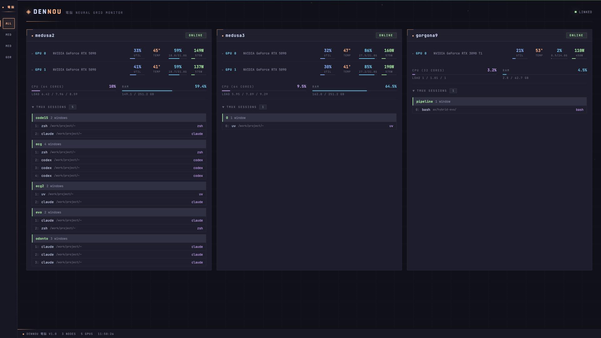

# ◈ dennou 電脳

Real-time GPU, system, and tmux monitoring dashboard for remote machines via SSH.

**Zero installation on remote hosts.** Runs locally and polls everything over SSH.

```
 ◈ dennou (your machine)
   ├── ssh server-1 → GPU, CPU, RAM, tmux sessions
   ├── ssh server-2 → GPU, CPU, RAM, tmux sessions
   └── ssh server-n → GPU, CPU, RAM, tmux sessions
```



## Features

- **GPU metrics** — utilization, temperature, memory, power draw via `nvidia-smi`
- **System metrics** — CPU %, RAM usage, load average
- **Tmux sessions** — live pane content preview, session/window tree
- **Real-time** — WebSocket-based updates every few seconds
- **SSH-only** — uses your existing SSH keys, no agents or Docker on remote machines
- **Single-file dashboard** — no build tools, no npm, cyberpunk Catppuccin Mocha theme
- **Keyboard shortcuts** — `0` for all machines, `1-9` to switch

## Setup

Requires Python 3.12+ and [uv](https://docs.astral.sh/uv/).

```bash
git clone https://github.com/aaaxn/dennou.git && cd dennou

# Install dependencies
uv sync

# Create your config
cp config.yaml.example config.yaml
vim config.yaml  # add your machines

# Run
uv run python -m dennou
```

Open **http://localhost:1312**

## Configuration

Edit `config.yaml`:

```yaml
machines:
  my-server:
    host: 192.168.1.100  # hostname, IP, or ~/.ssh/config alias
    user: myuser          # optional, defaults to $USER
    # port: 22            # optional

  gpu-node:
    host: gpu-node.local

settings:
  poll_interval: 3        # seconds between polls
  tmux_capture_lines: 25  # lines captured from each tmux pane
  port: 1312              # dashboard port
  host: 0.0.0.0           # listen address
```

The `host` field accepts hostnames from `~/.ssh/config`, IPs, or DNS names.

## SSH Setup

Make sure you can SSH to each machine without a password prompt:

```bash
ssh-keygen -t ed25519
ssh-copy-id my-server
ssh my-server nvidia-smi  # test
```

## Architecture

```
dennou/
  __main__.py       Entry point (python -m dennou)
  server.py         FastAPI server + WebSocket real-time loop
  config.py         YAML config loader
  ssh.py            SSH connection pool + command runner
  gpu.py            GPU metrics collector (nvidia-smi)
  system.py         System metrics collector (CPU, RAM, load)
  tmux.py           Tmux session collector (sessions, windows, panes)
web/
  index.html
```

Maintains persistent SSH connections via `asyncssh` and runs all collectors concurrently per machine.

## Inspiration

Inspired by [gpu-hot](https://github.com/psalias2006/gpu-hot).

## License

MIT
